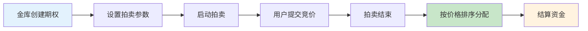
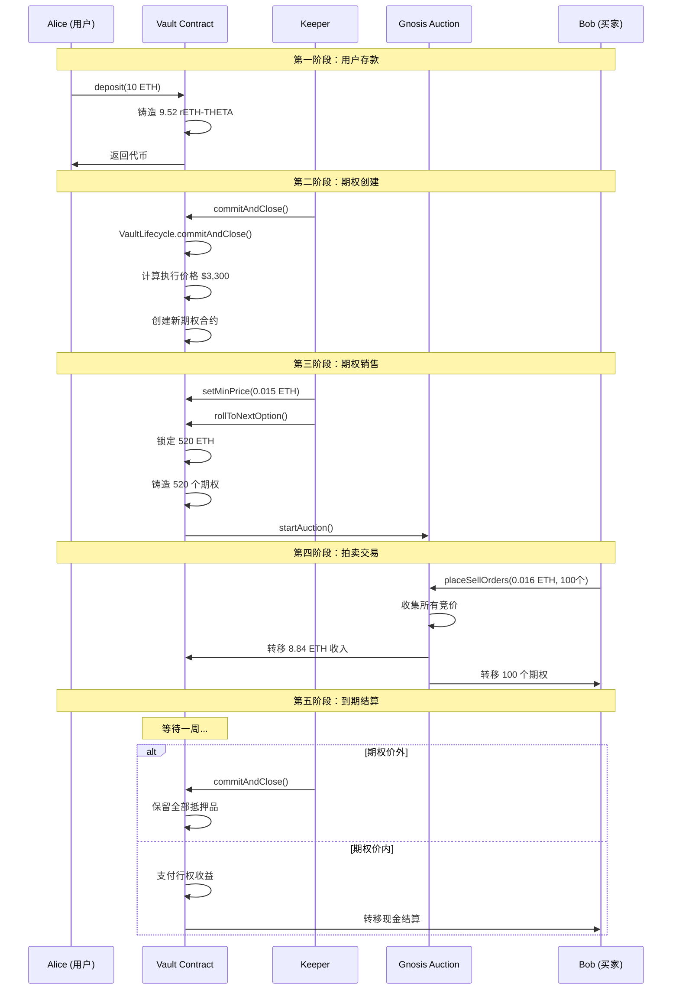
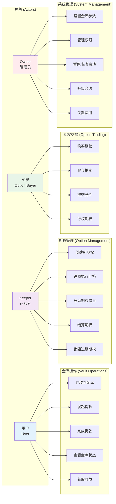
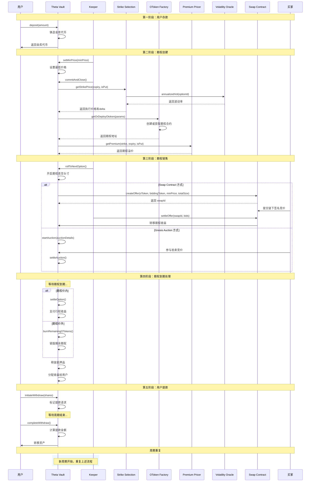
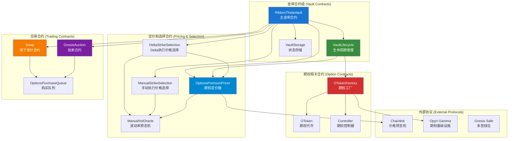
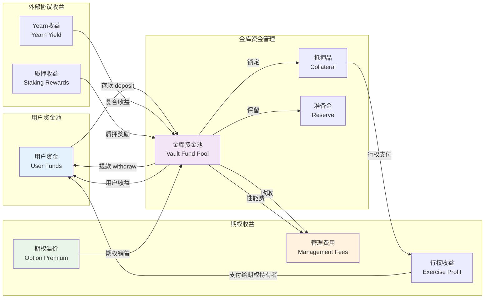

# Ribbon Finance v2 合约文档

## 项目概述

Ribbon Finance v2 是 Ribbon 的 Theta Vault 产品的下一代版本，为去中心化期权策略金库带来了重大改进。

### v2 主要特性

- **去中心化运营**: Theta Vault 操作完全去中心化
- **100%资本效率**: 金库资金完全被利用，无闲置资金
- **性能费用模式**: 取消提取费用，改为性能费用模式
- **元金库策略**: 通过组合多个 Theta Vault 创建复合策略

## 核心架构

Ribbon Finance v2 是一个去中心化期权协议，主要包含以下核心组件：

### 1. 金库类型 (Vault Types)

- **Theta Vault**: 核心期权销售金库，定期出售看涨/看跌期权
- **Treasury Vault**: 国库金库，为其他 DeFi 协议提供期权策略
- **STETH Vault**: 专门处理 Staked ETH 的金库
- **Yearn Vault**: 集成 Yearn 协议的复合收益金库

### 2. 期权管理系统

- **OToken Factory**: 基于 Opyn 协议的期权代币工厂
- **Strike Selection**: 执行价格选择算法（Delta-based, Manual, Percent-based）
- **Premium Pricing**: 期权溢价定价系统（基于 Black-Scholes 模型）
- **Volatility Oracle**: 波动率预言机系统

### 3. 交易机制

- **Gnosis Auction**: 传统拍卖机制
- **Swap Contract**: 新的链下签名竞价机制

## 期权系统详细说明

### 期权生命周期

Ribbon Finance 中的期权遵循以下生命周期：

#### 1. 期权创建阶段 (Option Creation)

```solidity
// 通过 VaultLifecycle.commitAndClose 创建期权
function commitAndClose(
    CloseParams calldata closeParams,
    Vault.VaultParams storage vaultParams,
    Vault.VaultState storage vaultState
) external returns (
    address otokenAddress,  // 创建的期权合约地址
    uint256 strikePrice,    // 执行价格
    uint256 delta          // 期权 Delta 值
)
```

**流程说明：**
1. **确定到期时间**: 根据当前期权到期时间计算下一个到期时间（通常为每周五）
2. **选择执行价格**: 通过 Strike Selection 合约确定期权执行价格
3. **创建/获取 OToken**: 通过 Opyn 的 OToken Factory 创建或获取现有期权合约
4. **计算期权溢价**: 使用 Black-Scholes 模型计算期权的理论价值

#### 2. 执行价格选择策略

Ribbon V2 的核心改进之一是**算法执行价格选择**，这是实现完全自动化和去中心化的关键步骤。

##### 为什么需要算法执行价格选择？

1. **去中心化**: 移除人为决策，将责任委托给代码，避免中心化风险
2. **可扩展性**: 支持创建数百或数千个金库，无需人工管理每个金库
3. **一致性**: 确保执行价格选择的公平性和透明性
4. **效率**: 自动化流程，减少运营成本和人为错误

##### Delta-based Strike Selection（基于 Delta 的执行价格选择）

Ribbon V2 使用固定的 **Delta 值 0.1** 来选择执行价格，这比简单的固定百分比策略更加智能：

```solidity
contract DeltaStrikeSelection {
    // Delta 值：1000 表示 0.1 delta（10% 概率价内）
    uint256 public constant delta = 1000;
    
    // 价格步长
    uint256 public step;
    
    function getStrikePrice(uint256 expiryTimestamp, bool isPut) 
        external view returns (uint256 newStrikePrice, uint256 newDelta) {
        // 获取年化波动率
        uint256 annualizedVol = volatilityOracle.annualizedVol(
            optionsPremiumPricer.optionId()
        );
        
        // 使用 Black-Scholes 模型计算满足目标 delta 的执行价格
        return _getStrikePrice(expiryTimestamp, isPut, annualizedVol);
    }
}
```

**算法优势**：
- **动态调整**: 根据市场波动率自动调整执行价格距离
- **风险控制**: 0.1 delta 意味着期权约有 10% 概率被行权，属于低风险策略
- **市场适应**: 高波动率时选择更远的价外期权，低波动率时相对较近

##### 波动率数据来源

```typescript
// 波动率获取策略
const volatilitySource = {
    // ETH/BTC: 使用 Deribit 的 10 日隐含波动率 (DVOL)
    mainAssets: "Deribit 10d IV",
    
    // 其他资产: 使用 RVOL 链上波动率预言机
    altcoins: "RVOL Oracle",
    
    // 更新频率: 每周手动更新（过渡期），最终全部使用 RVOL
    updateFrequency: "Weekly manual → Fully automated"
};
```

**Manual Strike Selection**（手动执行价格选择）:
```solidity
contract ManualStrikeSelection {
    uint256 public strikePrice;  // 管理员手动设置的执行价格
    
    function setStrikePrice(uint256 _strikePrice) external onlyOwner {
        strikePrice = _strikePrice;
    }
}
```

#### 3. 期权定价机制

期权溢价通过以下步骤计算：

```solidity
function _getOTokenPremium(
    address oTokenAddress,
    address optionsPremiumPricer,
    uint256 premiumDiscount
) internal view returns (uint256) {
    IOtoken newOToken = IOtoken(oTokenAddress);
    IOptionsPremiumPricer premiumPricer = IOptionsPremiumPricer(optionsPremiumPricer);

    // 1. 使用 Black-Scholes 公式计算理论溢价
    uint256 optionPremium = premiumPricer.getPremium(
        newOToken.strikePrice(),
        newOToken.expiryTimestamp(),
        newOToken.isPut()
    );

    // 2. 应用折扣以激励套利者
    optionPremium = optionPremium.mul(premiumDiscount).div(
        100 * Vault.PREMIUM_DISCOUNT_MULTIPLIER
    );

    return optionPremium;
}
```

#### 4. 期权销售机制

##### 为什么需要拍卖？

期权拍卖是 Ribbon Finance 的核心机制，它解决了去中心化期权销售的几个关键问题：

1. **价格发现**: 通过竞争性竞价发现期权的真实市场价值
2. **公平分配**: 确保所有参与者都有平等机会购买期权
3. **最大化收益**: 竞争性环境帮助金库获得最优的期权销售价格
4. **透明度**: 链上拍卖过程完全透明，避免暗箱操作
5. **去中心化**: 移除中心化的定价和分配机制

##### 拍卖机制设计原理



##### 两种拍卖方式对比

| 特性 | Gnosis Auction | Swap Contract |
|------|----------------|---------------|
| **执行方式** | 链上批量拍卖 | 链下签名 + 链上结算 |
| **Gas 效率** | 较高 Gas 费用 | 更低 Gas 费用 |
| **透明度** | 完全链上透明 | 链下竞价，链上结算 |
| **用户体验** | 需要等待拍卖结束 | 即时响应 |
| **适用场景** | 大额期权销售 | 小额频繁交易 |

**Gnosis Auction 方式**:
```solidity
struct AuctionDetails {
    address auctioningToken;    // 拍卖的期权代币
    address biddingToken;       // 竞价代币（如 USDC）
    uint256 orderCancellationEndDate;  // 取消订单截止时间
    uint256 auctionEndDate;     // 拍卖结束时间
    uint96 auctionedSellAmount; // 拍卖数量
    uint96 minBuyAmount;        // 最低购买金额
    uint256 minimumBiddingAmountPerOrder; // 单次最小竞价
    uint256 minFundingThreshold; // 最小资金门槛
}

function startAuction(AuctionDetails calldata auctionDetails)
    external returns (uint256 auctionId) {
    // 验证拍卖参数
    require(auctionDetails.auctioningToken != address(0), "Invalid token");
    require(auctionDetails.auctionEndDate > block.timestamp, "Invalid end time");
    
    // 启动 Gnosis 拍卖
    return GnosisAuction.startAuction(auctionDetails);
}
```

**拍卖参与流程**:
```solidity
// 用户参与拍卖
function placeSellOrders(
    uint256 auctionId,
    uint96[] memory _minBuyAmounts,
    uint96[] memory _sellAmounts,
    bytes32[] memory _prevSellOrders
) external {
    // 用户提交竞价订单
    // 订单按价格排序
    // 拍卖结束后按最优价格分配
}
```

**Swap Contract 方式** (新机制):
```solidity
// 1. 创建报价
function createOffer(
    address oToken,
    address biddingToken,
    uint96 minPrice,      // 最低价格
    uint96 minBidSize,    // 最小竞价数量
    uint128 totalSize     // 总数量
) external returns (uint256 swapId) {
    // 验证期权有效性
    require(IOtoken(oToken).expiryTimestamp() > block.timestamp, "Expired option");
    
    // 创建链下竞价报价
    offers[swapId] = Offer({
        seller: msg.sender,
        oToken: oToken,
        biddingToken: biddingToken,
        minPrice: minPrice,
        totalSize: totalSize,
        availableSize: totalSize
    });
    
    return swapId;
}

// 2. 结算竞价（支持批量处理）
function settleOffer(
    uint256 swapId,
    Bid[] calldata bids   // 链下签名的竞价
) external {
    Offer storage offer = offers[swapId];
    require(offer.seller != address(0), "Invalid offer");
    
    // 验证签名和执行交易
    for (uint i = 0; i < bids.length; i++) {
        _validateAndExecuteBid(swapId, bids[i]);
    }
}
```

##### 拍卖收益分配机制

```solidity
// 拍卖结束后的收益分配
function distributeAuctionProceeds(uint256 auctionId) internal {
    uint256 totalProceeds = auctionProceeds[auctionId];
    
    // 1. 扣除性能费用 (10%)
    uint256 performanceFee = totalProceeds.mul(performanceFeeRate).div(100 * FEE_MULTIPLIER);
    
    // 2. 扣除管理费用 (2% 年化)
    uint256 managementFee = totalAssets.mul(managementFeeRate).div(100 * FEE_MULTIPLIER).div(52);
    
    // 3. 剩余收益归用户
    uint256 userProceeds = totalProceeds.sub(performanceFee).sub(managementFee);
    
    // 更新金库总资产
    totalAssets = totalAssets.add(userProceeds);
}
```

##### 费用结构

根据 [Ribbon Finance 官方文档](https://docs.ribbon.finance/faq/dov-trading-and-options)，费用结构如下：

- **管理费**: 2% 年化费用，按周收取（2%/52）
- **性能费**: 10% 收益分成（仅在盈利时收取）
- **收费逻辑**: 
  ```solidity
  if (weeklyStrategy.isProfitable()) {
      chargePerformanceFee(premiumEarned * 0.1);
      chargeManagementFee(assetsManaged * 0.02 / 52);
  } else {
      // 亏损周期不收取任何费用
      noFeesCharged();
  }
  ```

##### 拍卖参与指南

**对于期权买家**:
1. **加入 Telegram**: [Ribbon 拍卖频道](https://t.me/ribbonfinance)
2. **访问拍卖网站**: 参与实时竞价
3. **准备资金**: 确保有足够的 USDC 或相应的竞价代币
4. **提交竞价**: 根据市场情况设定合理价格
5. **等待分配**: 拍卖结束后自动分配期权

**竞价策略建议**:
- 参考 Deribit 等平台的期权价格
- 考虑隐含波动率变化趋势
- 设置合理的价格区间，避免过高或过低
- 注意拍卖时间，避免最后时刻抢购

### Theta Vault 详细工作流程

#### 用户交互流程

**1. 存款 (Deposit)**:
```solidity
function deposit(uint256 amount) external {
    require(amount > 0, "!amount");
    require(amount <= availableCapacity(), "Exceeds vault cap");
    
    // 转移用户资产到金库
    asset.safeTransferFrom(msg.sender, address(this), amount);
    
    // 计算当前金库代币价格（非1:1比例）
    uint256 shares = amount.mul(10**decimals).div(pricePerShare());
    
    // 铸造金库代币给用户
    _mint(msg.sender, shares);
    
    // 存款在当前轮次不能立即用于期权策略
    depositReceipts[msg.sender] = DepositReceipt({
        amount: amount,
        round: vaultState.round
    });
    
    emit Deposit(msg.sender, amount, shares);
}

// 金库代币价格计算（动态变化）
function pricePerShare() public view returns (uint256) {
    uint256 totalSupply = totalSupply();
    if (totalSupply == 0) return 10**decimals;
    
    // 价格 = 总资产 / 总代币供应量
    return totalAssets().mul(10**decimals).div(totalSupply);
}
```

**重要提醒**：
- **非1:1比例**: 金库代币（如 rETH-THETA）与基础资产不是1:1兑换
- **价格动态变化**: 随着每周收取期权溢价，金库代币价格上涨
- **存款延迟**: 当轮存款不能立即参与期权策略，需等到下周期

**2. 提款 (Withdraw)**:
```solidity
// 发起提款请求
function initiateWithdraw(uint256 numShares) external {
    require(numShares > 0, "!numShares");
    require(balanceOf(msg.sender) >= numShares, "Insufficient balance");
    
    // 标记用户的提款请求
    withdrawalReceipts[msg.sender] = WithdrawalReceipt({
        shares: numShares,
        round: vaultState.round
    });
    
    // 锁定用户的代币，防止转移
    _lockShares(msg.sender, numShares);
    
    emit InitiateWithdraw(msg.sender, numShares, vaultState.round);
}

// 完成提款（只能在期权到期后）
function completeWithdraw() external {
    WithdrawalReceipt memory receipt = withdrawalReceipts[msg.sender];
    require(receipt.shares > 0, "No withdrawal initiated");
    require(receipt.round < vaultState.round, "Round not complete");
    
    // 计算用户可提取的资产数量
    uint256 withdrawAmount = receipt.shares.mul(pricePerShare()).div(10**decimals);
    
    // 销毁代币并转移资产
    _burn(msg.sender, receipt.shares);
    asset.safeTransfer(msg.sender, withdrawAmount);
    
    delete withdrawalReceipts[msg.sender];
    emit Withdraw(msg.sender, withdrawAmount, receipt.shares);
}
```

**提款规则**：
- **两步提款**: 先发起请求，等期权到期后才能完成提款
- **即时提款**: 如果当周存款但未参与期权策略，可以立即提款（调用 `maxRedeem()`）
- **代币锁定**: 发起提款请求后，相应代币被锁定无法转移

#### 金库运营流程

**1. 承诺并关闭当前期权 (Commit and Close)**:
```solidity
function commitAndClose() external onlyKeeper {
    // 1. 结算当前期权
    if (currentOption != address(0)) {
        _closeShort();
    }
    
    // 2. 创建新期权
    (address nextOption, uint256 strikePrice, uint256 delta) = 
        VaultLifecycle.commitAndClose(closeParams, vaultParams, vaultState);
    
    // 3. 更新状态
    vaultState.nextOption = nextOption;
    currentStrikePrice = strikePrice;
    
    emit NewOptionStrikeSelected(strikePrice, delta);
}
```

**2. 转移到下一期权 (Roll to Next Option)**:
```solidity
function rollToNextOption() external onlyKeeper {
    // 1. 开启新期权头寸
    _openShort();
    
    // 2. 启动期权销售拍卖/交换
    _startAuction();
    
    // 3. 更新金库状态
    _rollIntoNextPosition();
}
```

#### 期权到期处理

##### 现金结算机制

Ribbon Finance 采用**现金结算**而非实物交割，这简化了期权行权过程：

- **看涨期权**: 用抵押资产（如 ETH）进行现金结算
- **看跌期权**: 用 USDC 进行现金结算
- **自动行权**: 基于 Opyn V2，期权在到期时自动行权（无需手动操作）
- **结算时间**: 每周五 UTC 8:00 AM 到期，UTC 9:00-10:00 AM 完成结算

```solidity
function _closeShort() private {
    address currentOption = optionState.currentOption;
    if (currentOption != address(0)) {
        // 1. 检查期权是否到期（每周五 8:00 AM UTC）
        uint256 expiryTimestamp = IOtoken(currentOption).expiryTimestamp();
        require(block.timestamp >= expiryTimestamp, "Option not expired");
        
        // 2. 获取到期时的结算价格
        uint256 settlePrice = _getSettlementPrice(currentOption);
        uint256 strikePrice = IOtoken(currentOption).strikePrice();
        
        // 3. 计算期权价值并结算
        if (_isOptionInTheMoney(currentOption, settlePrice, strikePrice)) {
            // 如果期权价内，计算并支付现金收益
            uint256 cashSettlement = _calculateCashSettlement(
                currentOption, 
                settlePrice, 
                strikePrice
            );
            _settleOptionCash(currentOption, cashSettlement);
        } else {
            // 如果期权价外，销毁剩余期权代币
            _burnRemainingOTokens(currentOption);
        }
        
        // 4. 释放未使用的抵押品
        _withdrawCollateral();
    }
}

// 现金结算计算
function _calculateCashSettlement(
    address option,
    uint256 settlementPrice,
    uint256 strikePrice
) private view returns (uint256) {
    bool isPut = IOtoken(option).isPut();
    
    if (isPut) {
        // 看跌期权：max(Strike - Spot, 0)
        return strikePrice > settlementPrice 
            ? strikePrice.sub(settlementPrice) 
            : 0;
    } else {
        // 看涨期权：max(Spot - Strike, 0)
        return settlementPrice > strikePrice 
            ? settlementPrice.sub(strikePrice) 
            : 0;
    }
}
```

##### 期权行权指南

**对于期权持有者**:
1. **无需手动操作**: Opyn V2 会在到期时自动处理价内期权
2. **等待结算**: 到期后约 1 小时的争议期，之后可提取收益
3. **提取收益**: 前往 [Opyn 界面](https://opyn.co) 提取行权收益
4. **无截止时间**: 行权收益会永久锁定，随时可以提取

**结算流程时间线**:
```
周五 8:00 AM UTC  ─────┐
                      │ 期权到期
周五 9:00 AM UTC  ─────┼─────┐
                      │     │ 争议期（约1小时）
周五 10:00 AM UTC ─────┘     │
                            │ 可以提取收益
之后任何时间      ───────────────┘
```

##### APY 计算方法

根据[官方文档](https://docs.ribbon.finance/faq/dov-trading-and-options)，APY 计算方式：

```typescript
// APY 计算逻辑
function calculateAPY() {
    // 1. 计算过去4周的平均表现（排除价内周）
    const past4WeeksPerformance = [];
    
    for (let week of pastWeeks) {
        if (!week.isInTheMoney) {  // 排除期权被行权的周
            const weeklyYield = Math.pow(1 + week.performance, 52) - 1;
            past4WeeksPerformance.push(weeklyYield);
        }
    }
    
    // 2. 计算平均年化收益率
    const averageAPY = past4WeeksPerformance.reduce((a, b) => a + b) / past4WeeksPerformance.length;
    
    return averageAPY * 100; // 转换为百分比
}

// 示例：
// 第1周收益: +2% → 年化: (1.02)^52 - 1 = 180%
// 第2周收益: +1% → 年化: (1.01)^52 - 1 = 67%
// 第3周收益: -5% → 被排除（期权被行权）
// 第4周收益: +1.5% → 年化: (1.015)^52 - 1 = 110%
// 预计APY: (180% + 67% + 110%) / 3 = 119%
```

##### 风险提示

1. **Delta 中性**: Ribbon 金库**不是** Delta 中性策略，存在方向性风险
2. **价内风险**: 当期权被行权时，金库需要支付现金收益给期权持有者
3. **波动率风险**: 高波动率可能导致期权更容易价内
4. **费用影响**: 管理费和性能费已包含在历史表现和预期 APY 中

### 主要合约接口

#### IRibbonVault 接口
```solidity
interface IRibbonVault {
    function deposit(uint256 amount) external;
    function depositETH() external payable;
    function cap() external view returns (uint256);
    function depositFor(uint256 amount, address creditor) external;
    function vaultParams() external view returns (Vault.VaultParams memory);
}
```

#### IStrikeSelection 接口
```solidity
interface IStrikeSelection {
    function getStrikePrice(uint256 expiryTimestamp, bool isPut)
        external view returns (uint256, uint256);
    function delta() external view returns (uint256);
}
```

#### IOptionsPremiumPricer 接口
```solidity
interface IOptionsPremiumPricer {
    function getPremium(uint256 strikePrice, uint256 timeToExpiry, bool isPut) 
        external view returns (uint256);
    function getPremiumInStables(uint256 strikePrice, uint256 timeToExpiry, bool isPut) 
        external view returns (uint256);
    function getOptionDelta(uint256 spotPrice, uint256 strikePrice, 
        uint256 volatility, uint256 expiryTimestamp) external view returns (uint256 delta);
    function getUnderlyingPrice() external view returns (uint256);
}
```

### 使用示例

#### 部署和初始化 Theta Vault

```typescript
// 1. 部署期权溢价定价器
const premiumPricer = await deployContract("OptionsPremiumPricerInStables", [
    optionId,           // 期权 ID
    volatilityOracle,   // 波动率预言机
    priceOracle,        // 价格预言机
    sanityChecker      // 合理性检查器
]);

// 2. 部署执行价格选择器
const strikeSelection = await deployContract("DeltaStrikeSelection", [
    premiumPricer.address,  // 溢价定价器地址
    7500,                   // 目标 Delta (0.75)
    1000000000             // 价格步长
]);

// 3. 部署金库
const vault = await deployProxy("RibbonThetaVault", [
    {
        _owner: owner.address,
        _keeper: keeper.address,
        _feeRecipient: feeRecipient.address,
        _managementFee: ethers.utils.parseUnits("2", 6),    // 2% 管理费
        _performanceFee: ethers.utils.parseUnits("20", 6),  // 20% 性能费
        _tokenName: "Ribbon ETH Theta Vault",
        _tokenSymbol: "rETH-THETA",
        _optionsPremiumPricer: premiumPricer.address,
        _strikeSelection: strikeSelection.address,
        _premiumDiscount: 950,    // 5% 折扣
        _auctionDuration: 21600,  // 6小时拍卖
        _vaultParams: {
            asset: WETH_ADDRESS,
            underlying: WETH_ADDRESS,
            minimumSupply: ethers.utils.parseUnits("10", 18),
            cap: ethers.utils.parseUnits("1000", 18),
            decimals: 18,
            isPut: false
        }
    }
]);
```

#### 完整的期权周期操作

```typescript
// 1. 用户存款
await vault.connect(user).deposit(ethers.utils.parseEther("10"));

// 2. Keeper 设置最低价格
await vault.connect(keeper).setMinPrice(ethers.utils.parseUnits("0.01", 8));

// 3. Keeper 创建新期权
await vault.connect(keeper).commitAndClose();

// 4. Keeper 转移到新期权并启动销售
await vault.connect(keeper).rollToNextOption();

// 5. 等待期权到期
await time.increaseTo(optionExpiryTime);

// 6. 重复周期
await vault.connect(keeper).commitAndClose();
```


### 支持的网络和资产

- **Ethereum Mainnet**: ETH, WBTC, USDC
- **Avalanche**: AVAX, sAVAX, WBTC
- **测试网**: Kovan, Fuji

### 安全特性

1. **升级代理模式**: 使用 OpenZeppelin 的升级代理确保合约可升级性
2. **权限控制**: Owner 和 Keeper 角色分离
3. **重入保护**: 使用 ReentrancyGuard 防止重入攻击
4. **参数验证**: 严格的参数验证和边界检查
5. **暂停机制**: 紧急情况下可暂停金库操作


## 📋 真实案例：ETH Call 期权金库完整操作流程

### 案例背景
- **金库类型**: Ribbon ETH Theta Vault (看涨期权)
- **当前时间**: 2024年1月8日 周一 10:00 AM UTC
- **ETH 当前价格**: $3,000
- **金库当前状态**: 第15轮，已有 500 ETH 锁定在当前期权中

### 参与角色
- **Alice**: 普通用户，想要存入 10 ETH
- **Bob**: 期权买家，准备购买期权
- **Keeper**: 金库运营者（自动化机器人）
- **金库合约**: 0x25751853Eab4D0eB3652B5eB6ecB102A2789644

### 详细操作流程

#### 第一阶段：用户存款 (周一)

**1. Alice 存款 10 ETH**
```typescript
// 函数调用
await vault.connect(alice).deposit(ethers.utils.parseEther("10"));

// 资金流向
Alice钱包: 1000 ETH → 990 ETH (-10 ETH)
金库合约: 500 ETH → 510 ETH (+10 ETH)

// 代币分配
// 当前金库代币价格: 1.05 ETH/rETH-THETA (过去收益积累)
// Alice获得: 10 ETH ÷ 1.05 = 9.52 rETH-THETA 代币

// 合约状态变化
vaultState.totalPending: 0 → 10 ETH (Alice的存款进入待处理队列)
vaultState.round: 15 (不变，当轮存款下轮才能参与)
```

**2. 其他用户也在本周陆续存款**
```typescript
// 假设本周总共新增 40 ETH 存款
vaultState.totalPending: 10 ETH → 50 ETH
```

#### 第二阶段：期权到期和创建新期权 (周五)

**3. 当前第15轮期权到期处理**
```typescript
// 假设当前期权价外（ETH价格 $3,000 < 执行价格 $3,200）
// 期权过期无价值，金库保留全部抵押品

// 函数调用：结算当前期权
await vault.connect(keeper).commitAndClose();

// 内部调用
VaultLifecycle.commitAndClose(closeParams, vaultParams, vaultState);
```

**4. `commitAndClose` 详细执行过程**
```solidity
// 🕐 计算新期权到期时间
uint256 expiry = getNextExpiry(currentOption); // 下周五 8:00 AM UTC

// 🎯 获取执行价格选择器
IStrikeSelection selection = IStrikeSelection(closeParams.strikeSelection);

// 📋 读取金库基本信息
bool isPut = false;              // 看涨期权
address underlying = WETH;       // 底层资产：WETH
address asset = WETH;           // 抵押资产：WETH

// 🧮 算法选择执行价格
// 使用 Delta-based 策略，目标 Delta = 0.1
// 当前波动率 = 60% (年化)
// 时间到期 = 7天
// 算法计算得出执行价格 = $3,300
(strikePrice, delta) = selection.getStrikePrice(expiry, false);
// strikePrice = 3300 * 10^8 (8位小数)
// delta = 1000 (表示0.1 delta)

// 🏭 创建新期权合约
otokenAddress = getOrDeployOtoken(
    closeParams,
    vaultParams,
    WETH,           // underlying
    WETH,           // asset
    330000000000,   // strikePrice (3300 * 10^8)
    1705737600,     // expiry (下周五时间戳)
    false           // isPut
);

// 返回值
// otokenAddress: 0x789...123 (新期权合约)
// strikePrice: 330000000000 ($3,300)
// delta: 1000 (0.1)
```

**5. 状态更新**
```typescript
// 金库状态变化
optionState.nextOption = 0x789...123;           // 新期权地址
optionState.nextOptionReadyAt = block.timestamp; // 立即可用
vaultState.round: 15 → 16;                      // 轮次递增

// 资金状态
vaultState.lockedAmount: 500 ETH → 0;           // 释放上轮锁定资金
vaultState.lastLockedAmount: 400 ETH → 500 ETH; // 记录上轮金额（用于费用计算）
```

#### 第三阶段：启动新期权销售 (周五晚些时候)

**6. Keeper 设置期权最低售价**
```typescript
// 基于 Black-Scholes 模型计算的理论价值 + 折扣
await vault.connect(keeper).setMinPrice(ethers.utils.parseUnits("0.015", 8));
// 最低价格：0.015 ETH 每个期权 (已包含5%折扣)
```

**7. 启动新期权轮次**
```typescript
await vault.connect(keeper).rollToNextOption();

// 内部执行过程
// 1. 计算可用资金
uint256 availableFunds = 500 ETH (上轮释放) + 50 ETH (新存款) = 550 ETH;

// 2. 处理待提款
// 假设有用户申请提取 30 ETH 等值的代币
uint256 withdrawAmount = 30 ETH;
availableFunds = 550 ETH - 30 ETH = 520 ETH;

// 3. 锁定资金用于新期权
vaultState.lockedAmount = 520 ETH;

// 4. 创建期权头寸
// 一个期权合约 = 1 ETH，共铸造 520个期权
uint256 optionsMinted = VaultLifecycle.createShort(
    GAMMA_CONTROLLER,
    MARGIN_POOL,
    0x789...123,    // 新期权地址
    520 ETH         // 锁定金额
);
// 结果：铸造 520 个看涨期权合约

// 5. 启动期权销售拍卖
_startAuction();
```

#### 第四阶段：期权拍卖和销售 (周五-周六)

**8. 启动 Gnosis 拍卖**
```typescript
// 拍卖参数设置
AuctionDetails = {
    auctioningToken: 0x789...123,    // 期权合约地址
    biddingToken: USDC,              // 竞价使用USDC
    auctionEndDate: 现在 + 6小时,     // 6小时拍卖期
    auctionedSellAmount: 520 * 10^8, // 520个期权 (8位小数)
    minBuyAmount: 0.015 * 520 = 7.8 ETH // 最低总价
};

uint256 auctionId = GnosisAuction.startAuction(auctionDetails);
```

**9. 期权买家参与竞价**
```typescript
// Bob 提交竞价
await gnosisAuction.placeSellOrders(
    auctionId,
    [16000000],        // 购买金额：0.016 ETH 每个期权 (高于最低价)
    [100 * 10^8],      // 购买数量：100个期权
    [bytes32(0)]       // 排序参数
);

// 更多买家参与...
// 最终成交价格：0.017 ETH 每个期权
```

**10. 拍卖结算**
```typescript
// 6小时后拍卖结束，按价格排序分配
// 成交结果：
总销售收入 = 520个期权 × 0.017 ETH = 8.84 ETH

// 收益分配
管理费 = 520 ETH × 2% ÷ 52 = 0.2 ETH
性能费 = 8.84 ETH × 10% = 0.884 ETH  
用户净收益 = 8.84 - 0.884 = 7.956 ETH

// 金库总资产更新
总资产 = 520 ETH (锁定) + 7.956 ETH (净收益) = 527.956 ETH
```

#### 第五阶段：期权运行期 (下周)

**11. 期权在市场上交易**
```typescript
// Bob 获得100个看涨期权 (执行价格$3,300，到期下周五)
// 如果 ETH 价格上涨超过 $3,300，Bob 可以行权获利
// 如果 ETH 价格低于 $3,300，期权到期无价值

// 期权价值随时间和价格变化
if (ETH价格 > $3,300) {
    期权价值 = (当前价格 - $3,300) × 汇率
} else {
    期权价值 = 0
}
```

#### 第六阶段：期权到期结算 (下周五)

**12. 期权到期处理（两种情况）**

**情况A：期权价外 (ETH = $3,200)**
```typescript
// 期权无价值到期
await vault.connect(keeper).commitAndClose(); // 开始新一轮

// 金库保留全部抵押品
// Alice 的10 ETH 参与了这轮，获得了收益
// 新的金库代币价格 = 527.956 ETH ÷ 总代币供应量
```

**情况B：期权价内 (ETH = $3,500)**
```typescript
// 期权被行权，金库需要支付现金
行权收益 = ($3,500 - $3,300) × 520 = $104,000
现金支付 = $104,000 ÷ $3,500 = 29.7 ETH

// 金库资产减少
最终资产 = 527.956 ETH - 29.7 ETH = 498.256 ETH

// Alice 的收益计算
// 由于期权被行权，这轮收益为负，但之前积累的收益仍保留
```

### 关键函数调用时序图



### 资金流向总结

```
初始状态:    Alice: 1000 ETH    金库: 500 ETH
存款后:      Alice: 990 ETH     金库: 510 ETH
期权销售后:   Alice: 990 ETH     金库: 527.956 ETH
最终状态:    Alice: 999.6 ETH*   金库: 527.956 ETH

* Alice通过提取金库代币获得的价值增长
```

这个完整案例展示了 Ribbon Finance 从用户存款到期权到期的全生命周期，包括具体的数字、函数调用和资金流向。每个步骤都对应实际的智能合约操作，帮助理解整个系统的运作机制。


## 系统设计图表

### 产品架构图

```mermaid
graph TB
    subgraph "用户接口层 (User Interface)"
        UI[Web3 DApp]
        API[JSON-RPC API]
        HELPERS[Helper Contracts<br/>stETH/sAVAX Deposit Helpers]
    end
    
    subgraph "金库层 (Vault Layer)"
        subgraph "核心 Theta 金库"
            BTV[Base Theta Vault<br/>基础期权销售金库]
            SWAPV[Theta Vault with Swap<br/>链下竞价期权金库]
        end
        
        subgraph "资产专用金库"
            STETHV[STETH Theta Vault<br/>Lido质押ETH金库]
            RETHV[RETH Theta Vault<br/>Rocket Pool ETH金库]
            YV[Yearn Theta Vault<br/>复合收益金库]
        end
        
        subgraph "国库金库系列"
            TRV[Treasury Vault<br/>标准国库金库]
            TRVB[Treasury Vault Bare<br/>精简版国库金库]
            TRVL[Treasury Vault Lite<br/>轻量版国库金库]
            ACV[Autocall Vault<br/>自动赎回金库]
        end
        
        subgraph "安全机制"
            VP[Vault Pauser<br/>金库暂停器]
        end
    end
    
    subgraph "期权生命周期管理层 (Option Lifecycle)"
        VL[VaultLifecycle<br/>标准生命周期]
        VLWS[VaultLifecycleWithSwap<br/>Swap生命周期]
        VLSTETH[VaultLifecycleSTETH<br/>STETH生命周期]
        VLY[VaultLifecycleYearn<br/>Yearn生命周期]
        VLT[VaultLifecycleTreasury<br/>国库生命周期]
        VLTB[VaultLifecycleTreasuryBare<br/>精简国库生命周期]
    end
    
    subgraph "期权管理层 (Option Management)"
        OF[OToken Factory<br/>期权代币工厂]
        SS[Strike Selection<br/>执行价格选择]
        PP[Premium Pricing<br/>溢价定价]
        VO[Volatility Oracle<br/>波动率预言机]
    end
    
    subgraph "交易层 (Trading Layer)"
        GA[Gnosis Auction<br/>拍卖机制]
        SC[Swap Contract<br/>链下竞价机制]
        PQ[Purchase Queue<br/>购买队列]
    end
    
    subgraph "基础设施层 (Infrastructure)"
        OG[Opyn Gamma<br/>期权协议]
        CL[Chainlink<br/>价格预言机]
        YEARN[Yearn Protocol<br/>收益协议]
        LIDO[Lido<br/>质押协议]
        ROCKETPOOL[Rocket Pool<br/>ETH质押协议]
    end
    
    %% 用户接口连接
    UI --> BTV
    UI --> SWAPV
    UI --> STETHV
    UI --> RETHV
    UI --> YV
    UI --> TRV
    UI --> TRVB
    UI --> TRVL
    UI --> ACV
    
    HELPERS --> STETHV
    HELPERS --> LIDO
    
    %% 金库与生命周期管理连接
    BTV --> VL
    SWAPV --> VLWS
    STETHV --> VLSTETH
    RETHV --> VL
    YV --> VLY
    TRV --> VLT
    TRVB --> VLTB
    TRVL --> VLT
    ACV --> VL
    
    %% 生命周期管理与期权创建
    VL --> OF
    VLWS --> OF
    VLSTETH --> OF
    VLY --> OF
    VLT --> OF
    VLTB --> OF
    
    %% 期权管理层连接
    OF --> SS
    OF --> PP
    SS --> VO
    PP --> VO
    PP --> CL
    VO --> CL
    
    %% 交易层连接
    VL --> GA
    VLWS --> SC
    VLT --> GA
    VLTB --> GA
    
    GA --> PQ
    SC --> PQ
    
    %% 基础设施连接
    OF --> OG
    YV --> YEARN
    STETHV --> LIDO
    RETHV --> ROCKETPOOL
    
    %% 安全机制
    VP -.-> BTV
    VP -.-> SWAPV
    VP -.-> STETHV
    VP -.-> YV
    
    %% 样式
    style BTV fill:#1976d2,color:#fff
    style SWAPV fill:#f57c00,color:#fff
    style STETHV fill:#4caf50,color:#fff
    style RETHV fill:#ff9800,color:#fff
    style YV fill:#9c27b0,color:#fff
    style TRV fill:#e91e63,color:#fff
    style TRVB fill:#e91e63,color:#fff
    style TRVL fill:#e91e63,color:#fff
    style ACV fill:#795548,color:#fff
    style VP fill:#f44336,color:#fff
    style VL fill:#3f51b5,color:#fff
    style VLWS fill:#ff5722,color:#fff
    style OF fill:#2196f3,color:#fff
    style GA fill:#8bc34a,color:#fff
    style SC fill:#ffc107,color:#000
```



#### 📋 **金库类型详细说明**

**🎯 核心 Theta 金库**：
- **Base Theta Vault**: 基础期权销售金库，支持 ETH、WBTC 等主流资产的看涨/看跌期权策略
- **Theta Vault with Swap**: 集成链下竞价机制的期权金库，通过 Swap Contract 实现更高效的期权销售

**🏛️ 资产专用金库**：
- **STETH Theta Vault**: 专门处理 Lido 质押 ETH（stETH）的期权金库，享受质押收益 + 期权溢价双重收益
- **RETH Theta Vault**: 专门处理 Rocket Pool ETH（rETH）的期权金库，集成去中心化 ETH 质押
- **Yearn Theta Vault**: 集成 Yearn 协议的复合收益金库，资产在非期权期间自动进入 Yearn 策略

**🏦 国库金库系列**：
- **Treasury Vault**: 标准国库金库，为 DeFi 协议提供期权策略管理服务
- **Treasury Vault Bare**: 精简版国库金库，适用于无 Chainlink 价格预言机的资产
- **Treasury Vault Lite**: 轻量版国库金库，简化版功能适合特定场景
- **Autocall Vault**: 自动赎回金库，提供结构化产品功能

**🛡️ 安全机制**：
- **Vault Pauser**: 金库暂停器，紧急情况下可暂停金库操作以保护用户资金

#### 🔄 **期权创建流程映射**

每种金库都通过对应的生命周期管理库参与期权创建：

```typescript
// 金库 → 生命周期库 → 期权创建
Base Theta Vault → VaultLifecycle → commitAndClose() → OToken Factory
STETH Vault → VaultLifecycleSTETH → commitAndClose() → OToken Factory  
Swap Vault → VaultLifecycleWithSwap → commitNextOption() → OToken Factory
Yearn Vault → VaultLifecycleYearn → commitAndClose() → OToken Factory
Treasury Vault → VaultLifecycleTreasury → commitAndClose() → OToken Factory
```

所有生命周期库最终都调用 **Opyn 的 OToken Factory** 来创建或获取期权合约，实现了统一的期权创建标准。

### 用例图



### 期权生命周期时序图



### 核心合约交互图



### 资金流动图



## 总结

### 关键要点回顾

#### 1. 算法执行价格选择的重要性

参考 [Ribbon Finance 官方博客](https://ribbonfinance.medium.com/algorithmic-strike-selection-e07ae917c146)，算法执行价格选择是 V2 的核心改进：

- **去中心化目标**: 消除人为决策，实现真正的自动化
- **Delta 策略**: 使用固定 0.1 delta 值，确保约 10% 的期权行权概率
- **市场适应性**: 根据波动率动态调整执行价格，而非固定百分比
- **可扩展性**: 支持无限扩展金库数量，无需人工管理

#### 2. 期权拍卖的核心价值

拍卖机制是 Ribbon 成功的关键因素：

- **价格发现**: 通过市场竞争确定期权的真实价值
- **公平透明**: 所有参与者机会均等，过程完全透明
- **收益最大化**: 竞争环境确保金库获得最优价格
- **去中心化交易**: 避免传统金融的中心化定价问题

#### 3. 费用结构和收益机制

根据 [官方文档](https://docs.ribbon.finance/faq/dov-trading-and-options)：

```
盈利周期：
├── 期权溢价收入: 100%
├── 性能费 (10%): 扣除
├── 管理费 (2%/52): 扣除  
└── 用户收益: 剩余部分

亏损周期：
└── 无任何费用
```

#### 4. 技术架构优势

- **模块化设计**: 各组件职责分离，便于升级和维护
- **多样化金库**: 支持不同策略和资产类型
- **安全保障**: 多重安全机制和权限控制
- **用户友好**: 简化的交互流程和自动化操作

#### 5. 风险和注意事项

- **方向性风险**: 非 Delta 中性策略，存在市场方向风险
- **波动率风险**: 高波动率增加期权被行权概率
- **流动性限制**: 提款需要等待期权到期
- **智能合约风险**: 依赖外部协议和预言机

### 适用场景

**适合的用户**：
- 看好基础资产长期价值的投资者
- 希望通过期权策略获得额外收益
- 理解期权风险和收益特征
- 寻求被动收益策略的 DeFi 用户

**不适合的用户**：
- 需要随时提取资金的用户
- 对期权和波动率不了解的用户
- 无法承受方向性风险的投资者
- 寻求保本策略的保守投资者

### 未来发展方向

1. **RVOL 集成**: 完全过渡到链上波动率预言机
2. **多链部署**: 扩展到更多区块链网络
3. **策略丰富**: 开发更多元化的期权策略
4. **用户体验**: 简化交互流程，降低参与门槛

通过这份详细的文档，您可以全面了解 Ribbon Finance v2 的技术架构、期权机制、拍卖系统和实际应用。这个协议代表了 DeFi 期权领域的重要创新，将传统金融的期权策略成功地移植到了去中心化环境中。